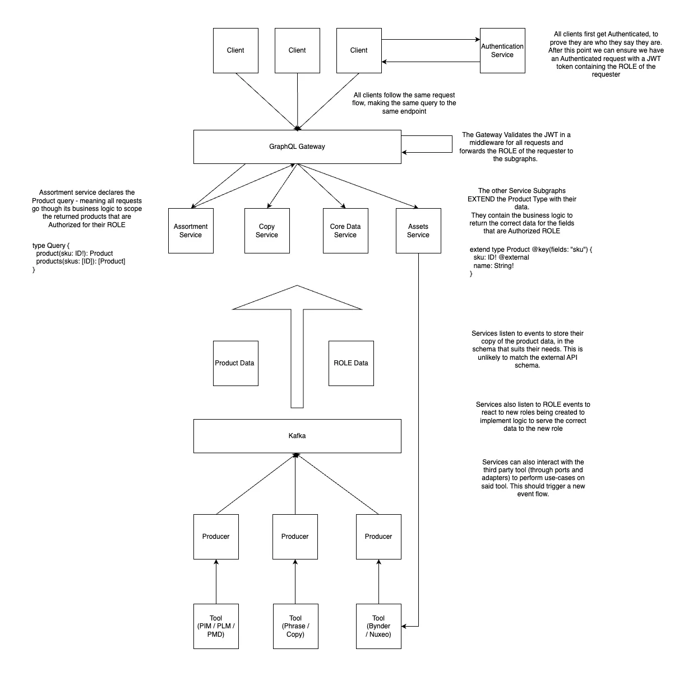

# Graphql Federation POC

This is a POC demonstration of how we can leverage GraphQL federation within the Product Domain to de-centralize our data, and empower sub-domains to have full control over their data.

## Summary (TLDR)

Using Federation allows for a single point of consumption of a global product model, while still allowing Authorization, Governance and Business logic to live within a sub-domain, where it belongs.

It enables teams to expose, govern and tailor their data to specific clients, without having to repeat this logic elsewhere.

The nature of Federation means there is a single entry point for Authentication, for all sub-domain services.

This approach de-centralizes the data, allowing experts to expose their slice, while still being consumed from a single point, with a single authentication method.

While data is de-centralized, living alongside the experts in the domain, Authentication, and which clients we serve, is centralized, since all sub-domains should have the same source of clientel.

## Diagram




## Quick start

To get the repo set up simply:
```
npm install
```

To run the services and the website run:
```
npm run dev
```

This will start:

The website on `http://localhost:3000`

The graphql playground in `http://localhost:4000`

## Cool things to see

* Each of the 3 mini sites use the **same query** but display **data tailored** to their needs
* To replicate this in the grapql playground you can add the headers of:
```
client-id: 'B2B' | 'PARTNER' | 'PUBLIC'
```

## Around the repo

The mini website is in the `website` directory. It:
*  a simple static html website
*  all websites use the same query
*  each website receives different tailored data

The Supergraph setup lives in `supergraph`. It:
* Stitches the schemas from the sub-graphs (subdomains)
* Adds the logic to forward the client type to the sub-graphs

Each of the other sub-graphs are domain services that:
* Have their domains internal data and schema in `data.ts`
* Set up their subgraph server in `index.ts`
* Set up their resolvers in `resolvers.ts`
* Exposes their external schema in `schema.graphql`
  
## Concepts overview

* Each client can recieve different data for the same query
* Authentication* is handled in the Supergraph
* Which skus are available to you is handled gracefully only in the assortment service sub-graph
* No sub-graphs can be queried directly, only via the assortment-service, to ensure you can only see what you are allowed to
* Field level logic (what to display per client) is handled in the relevant sub-graph service for that domain

/* No authentication has been implemented, just passing a header to the sub-graphs

## The request flow

1) The client makes a query, it adds its "authentication" parameters, if needed, to the request.
2) The Supergraph receives the query, it:
    * validates the authentication and ensures the scope is correct (is the user who is requesting B2B data actually a B2B app?)
    * passes the authentication credentials to the sub-graphs
3) The request first goes to the `assortment-service` as this declares the Graphql Type for the Product it:
    * validates which client is requesting the product/s
    * holds the logic with which client can see which products
    * only returns the data that client is able to see
4) From the products that are returned from the `assortment-service` (that the client can see) graphql then fills in the rest of the data from the sub-domains
5) Each sub-domain handles its own logic for returning data, because each sub-domain knows best who should see what, so it:
    * validates which client is requesting the field/s
    * chooses from its data which point to return for said field


## Concepts in more detail

### Each client can recieve different data for the same query

This allow us to have an external facing schema, that is still able to be personalized on a variety of factors. The client does not have to worry about the personalization logic, allowing them to be thin.

### Authentication* is handled in the Supergraph

The Supergraph is the entry point for all requests, here we can validate JWT and pass down the line which client is requesting the data to the sub-graphs. The sub-graphs can then perform even more validation or they can trust the supergraph (TBD). 

### Which skus are available to you is handled gracefully only in the assortment service sub-graph
and 
### No sub-graphs can be queried directly, only via the assortment-service, to ensure you can only see what you are allowed to

The assortment domain and their team know best about which clients can see which products. Their job is to validate the client requesting the data and work out which products to show to the user. This is important as all requests will go through the assortment-service, since it declares the type of the Product. 

If the user cannot see the product, the assortment-service simply returns null if the user cannot see the specific product they are requesting, or omits it from a list of products.

If the assortment service returns null, the other services are not queried to fill in the rest of the data.


### Field level logic (what to display per client) is handled in the relevant sub-graph service for that domain

The Sub Domains know their domain best. They know which data to provide to which client. It is their responsibility to provide their slice of the Product to the Supergraph.

Sub Domains expose a generic graph, that does not have to match their internal representation of the data. This means all clients can query the same field of the graph and still receive different results. e.g

* The copy subdomain has different copy for Ecom and B2B (true in On right now)
* The copy subdomain structures its internal data with these fields seperate (e.g: copyD2C and copyB2B) however they feel is best for their service.
* They expose only the field `copy`
* When a request comes in, they implement the business logic to:
    * Check who is the consumer
    * Serve the copy that suits them best

This keeps the business logic within the sub-domain, which is the best team to handle this.

The same can be applied to governance, if a user should not be able to see a specific field, they can just return null.

